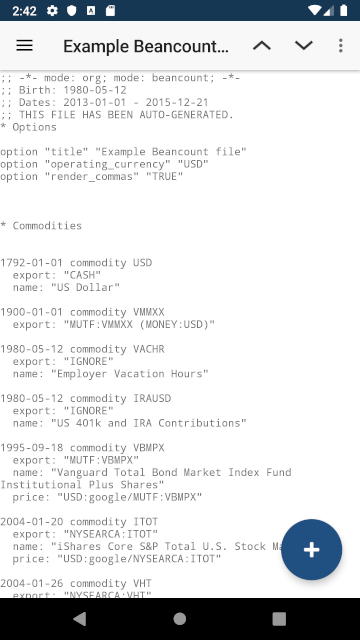
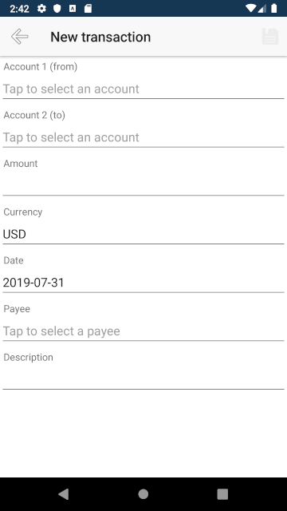

# Beancount Mobile App


This is a companion mobile application for [Beancount](http://furius.ca/beancount/) plain-text accounting system.

**Currently available only on Android.**

## Features

* Add transactions
* Open accounts
* View beancount file as plain text
* Switch between files




## Change log

See [CHANGELOG](CHANGELOG.md).

## Development

Prerequisites:

* Node.js & NPM
* [NativeScript CLI](https://docs.nativescript.org/angular/start/quick-setup#step-2-install-the-nativescript-cli) 5.4+

Install required packages:

```
npm install
```

### Android

Run on emulator:

```
tns run android
```

Build APK:

```
tns build android
```

### Testing

```
npm run lint
npm run test
```
