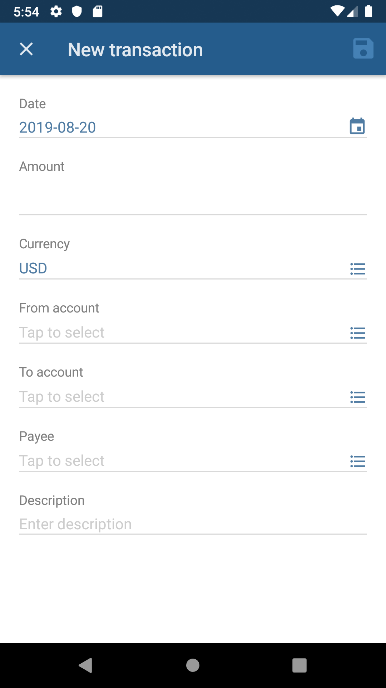

# Beancount Mobile App

[](https://github.com/xuhcc/beancount-mobile/releases)
[](https://github.com/xuhcc/beancount-mobile/blob/HEAD/LICENSE)

This is a companion mobile application for [Beancount](http://furius.ca/beancount/) plain-text accounting system.

**Currently available only on Android.** Version 6.0 (Marshmallow) or later is recommended.

<a href="https://play.google.com/store/apps/details?id=link.beancount.mobile"></a>

## Features

* Add transactions
* Open accounts
* Declare currencies
* View beancount file as plain text
* Switch between files

 

Note: Beancount Mobile currently has no file synchronization functionality, but it's possible to use software like [Syncthing](https://syncthing.net/) to sync Beancount file across multiple devices.

## Configuration

Beancount Mobile makes use of these configuration options:

* `option "title" "..."` - the title of ledger file.
* `option "operating_currency" "..."` - default currency for transactions.
* `1970-01-01 custom "bcm_option" "transaction_flags" "['*', '!']"` - allowed transaction flags.
* `1970-01-01 custom "bcm_option" "account_order" "to_from"` - show "to" account before "from" account in transaction form.

## Change log

See [CHANGELOG](CHANGELOG.md).

## Development

Prerequisites:

* Node.js & NPM
* [NativeScript CLI](https://docs.nativescript.org/angular/start/quick-setup#step-2-install-the-nativescript-cli) 7.0

Install required packages:

```
npm install
```

### Android

Run on emulator:

```
npm run android
```

Build APK:

```
npm run android-debug
```

### Testing

```
npm run lint
npm run test
```
